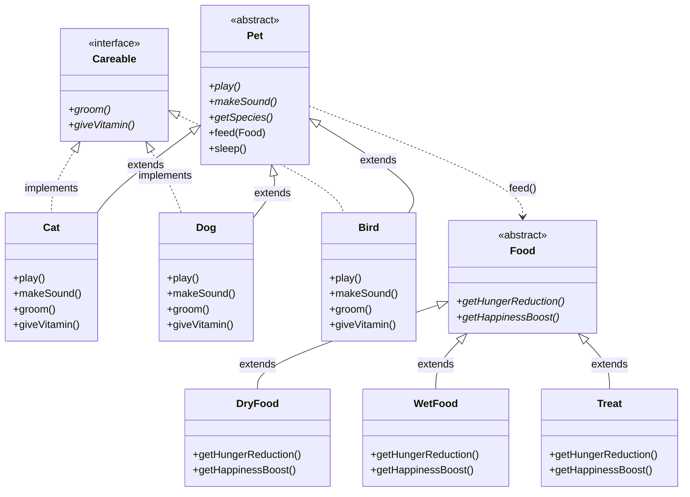

# 🎬 SCRIPT VIDEO 11 MENIT — VIRTUAL PET SIMULATOR

**Anggota:** A, B, C | **Durasi total:** ~11 menit

---

# 🟢 SESI 1 — PEMBUKAAN & CLASS DIAGRAM
**0:00–2:00 | PIC: A**

---

## 0:00–0:30 — Pembukaan

**A:**
"Halo, kami dari kelompok .... Kami akan mempresentasikan project UAS PBO kami, yaitu Virtual Pet Simulator — aplikasi desktop berbasis JavaFX yang mensimulasikan peliharaan virtual. Project ini menerapkan 4 pilar OOP: Encapsulation, Inheritance, Polymorphism, dan Abstraction. Saya A akan menjelaskan class diagram."

---

## 0:30–1:00 — Class Diagram

**A:**
(Tunjuk gambar class diagram)

"Ini class diagram project kami. Ada abstract class `Pet` sebagai parent. Pet punya 3 abstract method: `play()`, `makeSound()`, `getSpecies()`. Tiga subclass: Cat, Dog, Bird — semuanya `extends Pet` dan `implements Careable`."

"Lalu abstract class `Food` dengan abstract method `getHungerReduction()` dan `getHappinessBoost()`. Tiga turunannya: DryFood, WetFood, Treat — dengan efek berbeda. Semua terhubung ke GameGUI sebagai controller."

---

## 1:00–2:00 — Encapsulation + Inheritance

**A:**
"Pertama **Encapsulation**. Coba lihat kode ini:"

```
TAMPILKAN:
public abstract class Pet {

    protected String name;
    protected int hunger, happiness, energy, health;
    protected int age;
    protected int coins;

    public void setHunger(int hunger) {
        this.hunger = clamp(hunger, 0, 100);
    }
    public void setHappiness(int happiness) {
        this.happiness = clamp(happiness, 0, 100);
    }
    public void setEnergy(int energy) {
        this.energy = clamp(energy, 0, 100);
    }
    public void setHealth(int health) {
        this.health = clamp(health, 0, 100);
    }

    public int getHunger() { return hunger; }
    public int getHappiness() { return happiness; }
    public int getEnergy() { return energy; }
    public int getHealth() { return health; }
}
```

"Field-field seperti `hunger`, `happiness`, `energy`, `health` kita buat `protected` — hanya bisa diakses dari class ini dan turunannya. Untuk baca dan ubah dari luar, kita pakai getter dan setter. Setter menggunakan metode `clamp()` supaya nilai selalu di 0-100. Ini adalah **Encapsulation**."

"Sekarang **Inheritance**. Lihat kode ini:"

```
TAMPILKAN:
public class Cat extends Pet implements Careable {
    public Cat(String name) { super(name, 30, 70, 60); }
}
```

"Cat extends Pet artinya Cat mewarisi semua field dan method dari Pet — seperti `feed()`, `sleep()`, `getHunger()`. Constructor Cat memanggil `super()` dengan mengirim nama dan nilai awal. Cat tinggal override method spesifik seperti `play()`."

---

# 🟡 SESI 2 — LIVE DEMO: POLYMORPHISM + ABSTRACTION
**2:00–5:30 | PIC: B**

---

## 2:00–2:45 — Create Pet

**B:**
(Jalankan program via run.bat)

"Sekarang saya B akan mendemokan langsung program."

(Tunggu program muncul)

"Pertama kita buat pet baru. Isi nama, misalnya 'Mochi', pilih species Kucing, klik BUAT PET."

(Klik BUAT PET — pet muncul)

"Di belakang layar, method `createPet()` dipanggil:"

```
TAMPILKAN:
private void createPet(String name, String species) {
    switch (species.toLowerCase()) {
        case "kucing": pet = new Cat(name); break;
        case "anjing": pet = new Dog(name); break;
        case "burung": pet = new Bird(name); break;
    }
}
```

"Jadi tergantung species yang dipilih, object yang dibuat berbeda. Setelah itu pet muncul di tengah layar, dan statusnya bisa dilihat di panel bawah: Hunger, Happiness, Energy, Health."

(Klik pet untuk dengar suara)

"Pet juga bisa diklik — dia akan bersuara sesuai speciesnya."

---

## 2:45–4:00 — Polymorphism: Method Overriding (PLAY)

**B:**
"Sekarang kita coba **Polymorphism via Method Overriding**."

"Di kode, reference `pet` tipenya `Pet`, tapi isinya object `Cat`. Saat kita panggil `pet.play()`, yang jalan adalah `play()` versi Cat."

```
TAMPILKAN:
// Pet.java — abstract method
public abstract void play();

// Cat.java — override
@Override
public void play() {
    System.out.println(name + " bermain bola benang dengan ceria!");
    setHappiness(this.happiness + 15);
    setEnergy(this.energy - 10);
}
```

(Klik tombol Bermain)

"Kucing main bola benang. Happiness naik 15, Energy turun 10."

"Sekarang ganti ke Anjing."

```
TAMPILKAN:
// Dog.java — override
@Override
public void play() {
    System.out.println(name + " berlari kencang mengambil bola! (Fetch)");
    setHappiness(this.happiness + 20);
    setEnergy(this.energy - 20);
}
```

(Klik tombol ▶ ganti Anjing, klik PLAY)

"Anjing main fetch. Happiness naik 20, Energy turun 20. Tanpa mengubah kode, method `pet.play()` otomatis panggil versi Anjing karena objectnya sudah beda. Ini polymorphism."

"Sekarang Burung:"

```
TAMPILKAN:
// Bird.java — override
@Override
public void play() {
    System.out.println(name + " mengepakkan sayap dan terbang berputar!");
    setHappiness(this.happiness + 10);
    setEnergy(this.energy - 15);
}
```

(Klik ▶ ganti Burung, klik PLAY)

"Burung terbang. Happiness naik 10, Energy turun 15. Tiga species, tiga cara bermain, satu method call: `pet.play()`."

---

## 4:00–5:30 — Polymorphism: Parameter (FEED) + Abstraction

**B:**
"Sekarang **Polymorphism via Parameter**. Method `feed()` menerima parameter bertipe `Food`, tapi kita bisa memasukkan berbagai turunannya."

```
TAMPILKAN:
// Pet.java
public void feed(Food food) {
    int nutrisiMasuk = food.getHungerReduction();
    int bonusHappy = food.getHappinessBoost();
    setHunger(this.hunger - nutrisiMasuk);
    setHappiness(this.happiness + bonusHappy);
}
```

"Tiga jenis makanan:"

```
TAMPILKAN:
DryFood: getHungerReduction() = 10    getHappinessBoost() = 2   (harga 5)
WetFood: getHungerReduction() = 25    getHappinessBoost() = 8   (harga 10)
Treat:   getHungerReduction() = 5     getHappinessBoost() = 15  (harga 7)
```

(Klik Makan, pilih Makanan Kering)

"DryFood — Hunger turun 10, Happiness naik 2."

(Klik Makan lagi, pilih Makanan Basah)

"WetFood — Hunger turun 25, Happiness naik 8."

(Klik Makan lagi, pilih Snack)

"Treat — Hunger turun 5, Happiness naik 15. Method yang sama, parameter berbeda, hasil berbeda."

"Sekarang **Abstraction**:"

```
TAMPILKAN:
public abstract class Pet {

    public abstract void play();
    public abstract void makeSound();
    public abstract String getSpecies();
}
```

"Class Pet adalah abstract — tidak bisa diinstansiasi langsung. Ada 3 abstract method yang wajib di-override oleh subclass. Kalau ada yang bikin class Rabbit extends Pet tapi lupa implementasi `play()`, error compile. Ini memastikan perilaku semua pet lengkap."

---

# 🔵 SESI 3 — INTERFACE + JAWABAN REFLEKSI
**5:30–7:30 | PIC: C**

---

## 5:30–6:30 — Interface Careable

**C:**
"Sekarang saya C akan menjelaskan **Interface**."

```
TAMPILKAN:
public interface Careable {
    void groom();
    void giveVitamin();
}
```

"Interface `Careable` punya dua method: `groom()` untuk mandi dan `giveVitamin()` untuk vitamin. Interface ini diimplement oleh Cat, Dog, dan Bird."

```
TAMPILKAN:
public class Cat extends Pet implements Careable {
```

"Kita lihat implementasi `groom()` per species:"

```
TAMPILKAN:
// Cat.java
groom() -> setHappiness(this.happiness + 5)

// Dog.java
groom() -> setHappiness(this.happiness + 15)

// Bird.java
groom() -> setHappiness(this.happiness + 10)
```

"Dan `giveVitamin()` — semua sama: `setHealth(this.health + 15)`."

"Di GameGUI, sebelum panggil method, kita cek dulu:"

```
TAMPILKAN:
case "bath":
    if (pet instanceof Careable) {
        ((Careable) pet).groom();
    }
    break;

case "vitamin":
    if (pet instanceof Careable) {
        ((Careable) pet).giveVitamin();
    }
    break;
```

(Klik Vitamin)

"Kucing dikasih vitamin — Sehat naik 15."

(Klik Mandi)

"Kucing dimandikan — Happiness naik 5."

---

## 6:30–7:30 — Jawaban Refleksi

**C:**
"Sekarang refleksi Milestone 5:"

**1. Apa yang berubah setelah refactor ke abstract?**
"Sebelumnya tanpa kontrak — tiap subclass punya method sendiri. Setelah Pet jadi abstract dengan 3 abstract method, semua wajib diimplementasi. Struktur lebih rapi dan aman."

**2. Kalau subclass lupa implementasi abstract method?**
"Error compile. Java memaksa. Solusinya: implementasi semua, atau jadikan class itu abstract juga."

**3. Keuntungan abstract class?**
"Memaksa kontrak, tidak bisa diinstansiasi langsung, bisa punya concrete method (seperti feed, sleep) sekaligus abstract method."

**4. Kapan tidak pakai abstract class?**
"Kalau butuh multiple inheritance — pakai interface. Kalau cuma kontrak tanpa field — pakai interface. Kalau tidak perlu method abstrak — class biasa."

---

# 🟣 SESI 4 — FITUR LAIN (SHOP, MINI GAME, SAVE)
**7:30–9:30 | PIC: A**

---

## 7:30–8:15 — Shop

**A:**
(Klik Shop)

```
TAMPILKAN:
String[] itemNames = { "Makanan Kering", "Makanan Basah", "Snack", "Vitamin" };
int[] itemPrices = { 5, 10, 7, 15 };
```

"Fitur shop: beli item pakai koin. Makanan Kering 5 koin, Makanan Basah 10, Snack 7, Vitamin 15."

"Saat klik Beli:"

```
TAMPILKAN:
if (pet.getCoins() < itemPrices[idx]) {
    showToast("Koin tidak cukup!");
    return;
}
pet.addCoins(-itemPrices[idx]);
switch (idx) {
    case 0: dryFoodStock++; break;
    case 1: wetFoodStock++; break;
    case 2: treatStock++;  break;
    case 3: vitaminStock++; break;
}
saveToDB();
```

(Klik Beli salah satu)

"Setelah beli, stok bertambah dan tersimpan otomatis."

---

## 8:15–9:00 — Mini Game

**A:**
(Klik Mini Game)

```
TAMPILKAN:
Label titleLbl = new Label("🎮 Reaction Clicker");
Label timeLbl = new Label("Time: 20s");
int[] score = { 0 };
int[] timeLeft = { 20 };
```

"Mini Game: Reaction Clicker. Klik target yang muncul acak dalam 20 detik."

```
TAMPILKAN:
// Target makin cepat tiap klik
gameMoveTimer = new Timeline(new KeyFrame(Duration.millis(1200), e -> {
    target.setLayoutX(randomX, randomY);
    target.setVisible(true);
}));

// Setelah 20 detik
int reward = score * 3 + 5;
pet.addCoins(reward);
pet.setHappiness(happiness + score * 2);
```

"Setiap klik, target makin cepat (dari 1200ms turun ke minimal 300ms). Selesai: reward = score × 3 + 5 koin, happiness + score × 2."

(Demo: klik target beberapa kali, tunggu selesai)

---

## 9:00–9:30 — Save / Leaderboard

**A:**
"Save otomatis tiap 30 detik:"

```
TAMPILKAN:
private void startAutoSave() {
    saveTimer = new Timeline(new KeyFrame(Duration.seconds(30), e -> {
        if (pet != null) { saveToDB(); }
    }));
    saveTimer.setCycleCount(Animation.INDEFINITE);
    saveTimer.play();
}
```

"Save juga saat ganti pet dan tutup aplikasi. Data ke file saves/pet_save.dat dan MySQL."

(Klik Leaderboard)

```
TAMPILKAN:
String sql = "SELECT * FROM pet_save ORDER BY level DESC, coins DESC LIMIT 50";
```

"Leaderboard: peringkat berdasarkan level tertinggi dan koin terbanyak. Juga ada fitur kirim hadiah dan guestbook antar pemain."

---

# ⚪ SESI 5 — PENUTUP
**9:30–10:30 | PIC: A, B, C**

---

**A:** "Kesimpulannya project ini menerapkan 4 pilar OOP:"

**B:** "**Encapsulation** — field `protected` + getter/setter di Pet."

**C:** "**Inheritance** — Cat, Dog, Bird extends Pet, mewarisi feed(), sleep(), dll."

**A:** "**Polymorphism** — `pet.play()` (method overriding) + `feed(Food food)` (parameter polymorphism)."

**B:** "**Abstraction** — abstract class Pet dan Food, interface Careable."

**C:** "Source code sudah di-upload, bisa di-compile dan di-run tanpa error. Laporan lengkap. **Terima kasih!**"

---

# ⏱️ RINGKASAN DURASI PER ORANG

| Orang | Segmen | Total |
|-------|--------|-------|
| **A** | Pembukaan (0:00) + Class Diagram (0:30) + Encapsulation/Inheritance (1:00) + Shop (7:30) + Mini Game (8:15) + Save/Leaderboard (9:00) + Closing (9:30) | **~4 menit** |
| **B** | Create Pet (2:00) + Polymorphism Play (2:45) + Polymorphism Feed & Abstraction (4:00) + Closing (9:30) | **~3,5 menit** |
| **C** | Interface Careable (5:30) + Refleksi (6:30) + Closing (9:30) | **~2,5 menit** |

---

# 📌 CATATAN DEMO

- **MySQL**: nyalakan sebelum demo untuk Leaderboard, Gift, Guestbook
- **Pet**: buat 2 pet (Kucing + Anjing) sebelum rekam agar tinggal klik ▶
- **Error DB**: bilang "koneksi database tidak tersedia, aplikasi tetap berjalan dengan save lokal"
- **Sound warning** `--enable-native-access` bisa diabaikan — bukan error
- **Shortcut keyboard**: 1=Makan, 2=Bermain, 3=Mandi, 4=Vitamin, 5=Tidur

---

## Cara pakai script ini:

1. Buka file ini di layar (atau print)
2. Setiap kali ada teks `TAMPILKAN:` — cukup tunjuk kode yang sudah tertulis di bawahnya
3. Tidak perlu cari baris lagi — semua kode sudah ada di sini

---

## LAMPIRAN — Class Diagram (Mermaid)

Copy-paste kode ini ke https://mermaid.live untuk lihat diagram:


